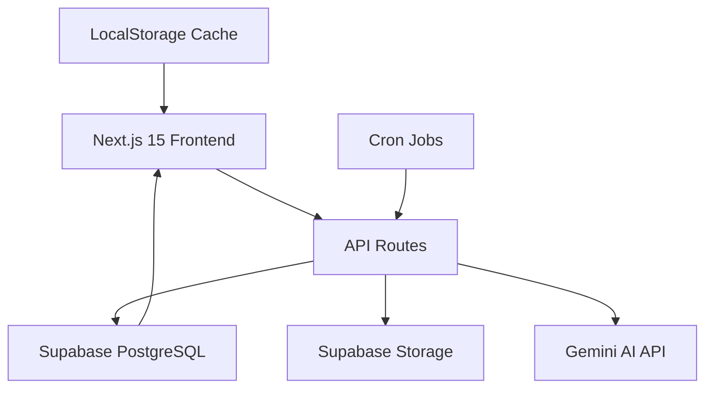
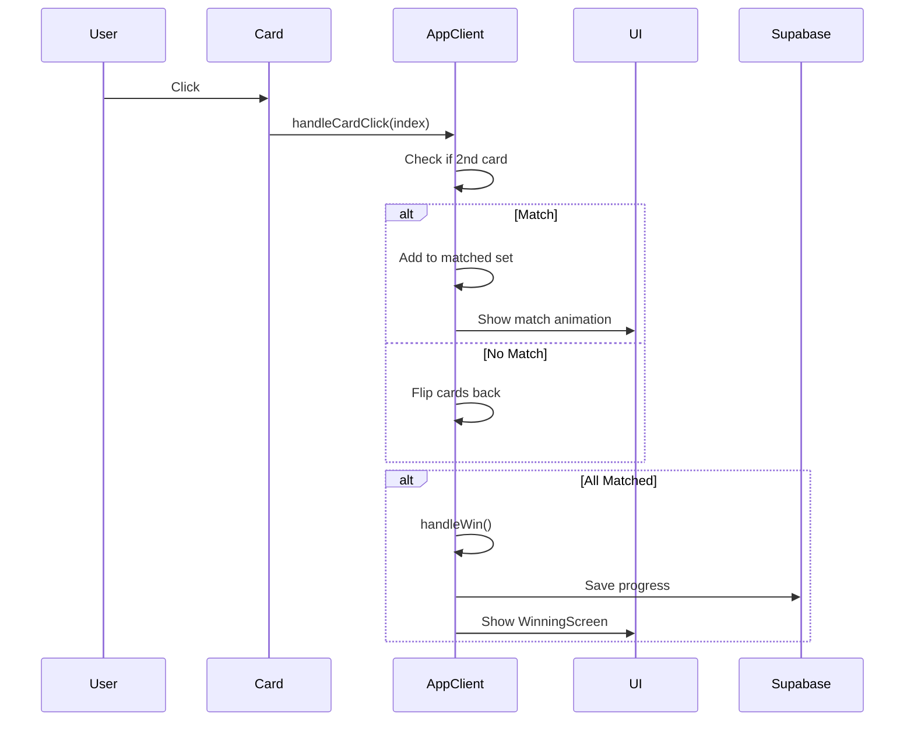
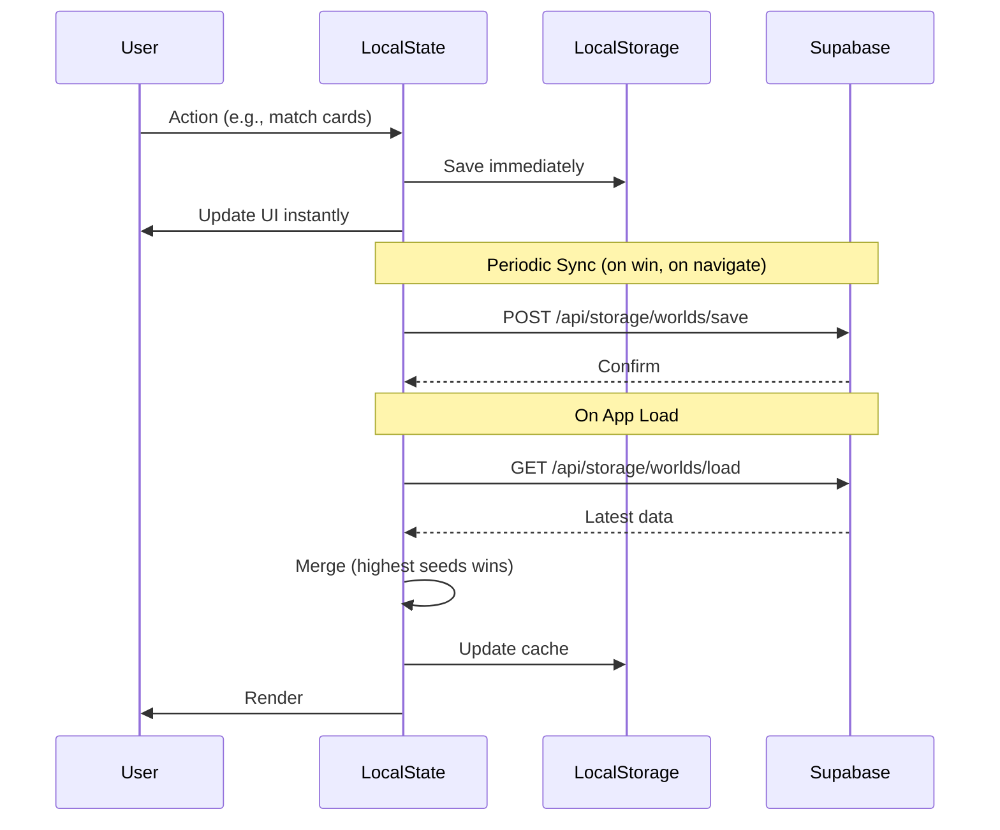

# Vocado - Comprehensive Project Documentation

**Version:** 1.0  
**Last Updated:** February 2026

## Table of Contents

1. [Project Overview](#project-overview)
2. [Core Features](#core-features)
3. [Technical Architecture](#technical-architecture)
4. [Database Schema](#database-schema)
5. [API Routes](#api-routes)
6. [Frontend Components](#frontend-components)
7. [Data Flow & State Management](#data-flow--state-management)
8. [Implementation Details](#implementation-details)

---

## Project Overview

**Vocado** is a gamified language learning application that combines memory card mechanics with AI-generated content to help users expand their vocabulary through real-world news articles and curated word collections.

### Key Principles
- **Gamification**: Learn through engaging memory games
- **Real-world Content**: Daily news articles from Tagesschau
- **AI-Powered**: Intelligent vocabulary extraction and content generation
- **Offline-First**: Optimistic updates with robust synchronization
- **Multi-language**: Support for 5+ language pairs

---

## Core Features

### 1. 🎮 Vocabulary Memory Game

**Description**: Classic memory card matching game where users match words in their source language with target language translations.

**Game Modes**:
- **Vocab Mode**: Match word pairs (e.g., Spanish ↔ German)
- **Conjugation Mode**: Learn verb conjugations with dedicated UI

**Features**:
- 🃏 **Card Flipping**: Smooth animations with front/back states
- ✨ **Match Validation**: Automatic matching with visual feedback
- 🎯 **Progress Tracking**: Real-time display of matched pairs
- 📊 **Performance Scoring**: Seeds earned based on moves and speed
- 🎨 **Rich Content**: Emoji/image support, explanations, examples

**Implementation**:
- Component: `/components/AppClient.tsx`
- Game Logic: Handles card state, matching, shuffle, win conditions
- Scoring: Fewer moves = more seeds (perfect game bonus)

---

### 2. 📰 Daily News Integration

**Description**: Automatically fetches and processes daily news articles for vocabulary learning.

**Workflow**:
1. **Fetch**: Cron job pulls headlines from Tagesschau API
2. **Process**: AI extracts vocabulary and generates summaries
3. **Store**: Saves to `daily_news` table in Supabase
4. **Display**: Users browse news cards and play matching games

**Features**:
- 📅 **Daily Refresh**: New content every day at midnight
- 🌍 **Categories**: World news, Economy (Wirtschaft), Sports
- 🎚️ **Level-Based**: Content adapted to A1-C2 CEFR levels
- 🔁 **Dual Language**: Summaries in both source and target languages
- 💾 **Caching**: LocalStorage for instant loading

**Data Structure**:
```typescript
news: {
  title: string            // Original language (e.g., German)
  summary: string[]        // Translated summary (user's language)
  summary_source: string[] // Original language summary
  sourceUrl: string        // Link to article
  category: string         // world | wirtschaft | sport
  date: string            // ISO date
}
```

**Implementation**:
- Frontend: `/components/NewsClient.tsx`, `/components/newhomescreen/NewHomeClient.tsx`
- API: `/app/api/news/daily/route.ts` (fetch), `/app/api/news/share/route.ts` (save)
- Cron: `/app/api/cron/news/route.ts` (automated generation)
- Database: `daily_news` table

---

### 3. 🌍 World System

**Description**: Vocabulary sets organized into "Worlds" - thematic or news-based collections.

**World Types**:
- **News Worlds**: Generated from daily articles
- **Custom Worlds**: User-created or curated sets
- **Pre-made Worlds**: Stored in `/data/worlds/*.json`

**Structure**:
```typescript
type VocabWorld = {
  id: string
  title: string
  mode: "vocab" | "phrase"
  chunking: { itemsPerGame: number }
  pool: VocabPair[]
  source_language?: string
  target_language?: string
  news?: NewsMetadata
  ui?: WorldUI  // Localized labels
}
```

**Features**:
- 📦 **Chunking**: Worlds split into levels (e.g., 50 words → 5 levels of 10)
- 🔄 **Level Progress**: Track completion per level
- 🎨 **Custom UI**: Language-specific labels and templates
- 📱 **Storage**: Worlds saved in Supabase Storage bucket

**Implementation**:
- Types: `/types/worlds.ts`
- Storage API: `/app/api/storage/worlds/`
- UI: `/components/newhomescreen/WorldsClient.tsx`

---

### 4. 👤 User Profiles & Authentication

**Description**: User accounts with personalized settings and progress tracking.

**Authentication**:
- **Provider**: Supabase Auth with Google OAuth
- **Flow**: PKCE flow with automatic token refresh
- **Session**: Persistent across browser sessions

**Profile Settings**:
```typescript
type ProfileSettings = {
  sourceLanguage: string    // User's native language
  targetLanguage: string    // Language they're learning
  level: string            // A1, A2, B1, B2, C1, C2
  newsCategory: string     // world | wirtschaft | sport
  avatarUrl?: string  
}
```

**Stored Data**:
- ✅ Profile preferences
- 📊 Seeds (currency) and XP
- 🏆 Leaderboard scores
- 📚 Saved worlds and lists
- 📈 SRS (Spaced Repetition) progress

**Implementation**:
- Auth: `/app/api/auth/`
- Profile UI: `/components/newhomescreen/ProfileClient.tsx`
- Database: `profiles` table
- Google Login: Native Google Identity Services (GIS)

---

### 5. 🏆 Gamification & Progression

**Description**: Reward system to motivate learning.

**Currency**:
- 🌱 **Seeds**: Primary currency earned from games
  - Base: `50 - moves` seeds
  - Perfect game: 2x multiplier
  - Speed bonus: Additional multiplier

- ⭐ **XP**: Experience points for leveling up

**Leaderboards**:
- 🌍 **Global**: All-time top performers
- 📅 **Weekly**: Resets every week
- 🎯 **Score Calculation**: Based on seeds earned

**Daily Goals**:
- Games played today
- Words learned today
- Current streak

**Implementation**:
- Leaderboard API: `/app/api/leaderboard/route.ts`
- Scoring Logic: `AppClient.tsx` (handleWin function)
- Database: `leaderboard` table with weekly partitioning

---

### 6. 🔄 Spaced Repetition System (SRS)

**Description**: Algorithm to optimize vocabulary review timing.

**Buckets**:
- 🆕 **New**: Never reviewed
- 🔴 **Hard**: Review soon (1 day)
- 🟡 **Medium**: Review later (3 days)
- 🟢 **Easy**: Review much later (7 days)

**Process**:
1. User matches a card
2. System updates `srs.bucket` and `nextReviewAt`
3. Future sessions prioritize due cards

**Data Structure**:
```typescript
type VocabSRS = {
  bucket: "new" | "hard" | "medium" | "easy"
  lastReviewedAt: string | null
  nextReviewAt: string | null
}
```

**Implementation**:
- Logic: `AppClient.tsx` (updateSRSBucket)
- Storage: Embedded in VocabPair objects
- Sync: Periodic save to Supabase Storage

---

### 7. 🔥 Streaks & Daily Challenges

**Description**: A habit-building system that rewards consistency and daily engagement.

**Streak System (Ripeness)**:
- **Concept**: User's knowledge "ripens" over consecutive days of play.
- **Levels**: 0 (Seed) → 7 (Ripe Avocado).
- **Mechanic**: Play at least one game to increase ripeness. Miss a day, and ripeness resets to 0 (Rotten).
- **Harvest**: Every 7 days, users "Harvest" their progress for a huge bonus, resetting ripeness but incrementing `harvest_count`.

**Daily Challenges**:
Three daily goals to boost engagement:
1. 📰 **Newspaper**: Read or play a News World. (+10 pts)
2. 📝 **Vocab**: Review 20 vocabulary words. (+15 pts)
3. 🎯 **Perfect Score**: Complete a game with ≥8 pairs in ≤14 moves. (+20 pts)

**Tracking**:
- Stored in `profiles.daily_challenges` JSONB.
- Resets automatically at midnight (client-local time).

**Implementation**:
- Logic: `/app/api/profile/update/route.ts` handles all streak/challenge logic atomically.
- UI: `VocablesClient.tsx` (popups), `ProfileClient.tsx` (stats).

---

## Technical Architecture

### Stack Overview



### Frontend
- **Framework**: Next.js 15 (App Router)
- **Language**: TypeScript
- **Styling**: Tailwind CSS
- **UI Components**: Radix UI, Lucide Icons
- **Animations**: Framer Motion
- **State**: React hooks + LocalStorage

### Backend
- **Runtime**: Node.js (Vercel Serverless)
- **Database**: Supabase (PostgreSQL)
- **Storage**: Supabase Storage (S3-compatible)
- **AI**: Google Gemini Flash API
- **Cron**: Vercel Cron Jobs

### Infrastructure
- **Hosting**: Vercel
- **CDN**: Vercel Edge Network
- **Auth**: Supabase Auth (Google OAuth)
- **Environment**: Production (.env variables)

---

## Database Schema

### Tables

#### `profiles`
User profile data and settings.

```sql
CREATE TABLE profiles (
  id UUID PRIMARY KEY REFERENCES auth.users,
  username TEXT,
  source_language TEXT DEFAULT 'Español',
  target_language TEXT DEFAULT 'Deutsch',
  level TEXT DEFAULT 'A2',
  news_category TEXT DEFAULT 'world',
  avatar_url TEXT,
  seeds INTEGER DEFAULT 0,
  xp INTEGER DEFAULT 0,
  gemini_api_calls INTEGER DEFAULT 0,
  daily_challenges JSONB DEFAULT '{}', -- Track daily progress (vocab, newspaper, perfect)
  daily_seeds INTEGER DEFAULT 0,       -- Seeds earned today
  daily_seeds_date TIMESTAMPTZ,        -- Date for daily reset
  ripeness_level INTEGER DEFAULT 0,    -- Current streak level (0-7+)
  longest_streak INTEGER DEFAULT 0,    -- All-time best streak
  harvest_count INTEGER DEFAULT 0,     -- Number of weekly harvests
  last_played_date DATE,               -- For streak calculation
  weekly_seeds INTEGER DEFAULT 0,      -- Weekly leaderboard score
  weekly_seeds_week_start DATE,        -- Weekly reset date
  created_at TIMESTAMPTZ DEFAULT NOW(),
  updated_at TIMESTAMPTZ DEFAULT NOW()
);
```

**Indexes**:
- Primary key on `id`
- Index on `source_language` and `level` for news generation

---

#### `daily_news`
Stores AI-generated news content.

```sql
CREATE TABLE daily_news (
  id UUID PRIMARY KEY DEFAULT gen_random_uuid(),
  date DATE NOT NULL,
  category TEXT NOT NULL,
  source_language TEXT NOT NULL,
  target_language TEXT NOT NULL,
  level TEXT NOT NULL,
  source_url TEXT,
  title TEXT,
  json JSONB NOT NULL,
  created_at TIMESTAMPTZ DEFAULT NOW()
);
```

**Indexes**:
```sql
-- Composite index for main query pattern
CREATE INDEX idx_daily_news_lookup 
ON daily_news (date, category, source_language, level);

-- Date index for cleanup
CREATE INDEX idx_daily_news_date ON daily_news (date);

-- URL index for deduplication
CREATE INDEX idx_daily_news_source_url ON daily_news (source_url);
```

**Cleanup Strategy**:
- Cron job deletes entries where `date != today`
- Keeps only current day's news to prevent bloat

---

#### `leaderboard`
Global and weekly high scores.

```sql
CREATE TABLE leaderboard (
  id UUID PRIMARY KEY DEFAULT gen_random_uuid(),
  user_id UUID REFERENCES auth.users,
  username TEXT,
  score INTEGER NOT NULL,
  week_start DATE,  -- NULL for global, date for weekly
  created_at TIMESTAMPTZ DEFAULT NOW()
);
```

**Partitioning**:
- Global leaderboard: `week_start IS NULL`
- Weekly leaderboard: `week_start = '2026-01-27'` (example)

---

### Storage Buckets

#### `worlds`
Stores user-created and saved worlds as JSON files.

**Structure**:
```
worlds/
  {user_id}/
    worlds/
      {world_id}.json
    lists/
      {list_id}.json
```

**Permissions**:
- Users can read/write their own folder
- RLS policies enforce isolation

---

## API Routes

### `/api/ai` - AI Content Generation

**POST** `/api/ai/route.ts`

Generates vocabulary from text, images, themes, or news articles using Gemini AI.

**Tasks**:
- `parse_text`: Extract vocab from user input
- `parse_image`: OCR + vocab extraction
- `theme_list`: Generate themed vocabulary
- `conjugate`: Generate verb conjugation tables
- `news`: Process news article → summary + vocab

**Request**:
```typescript
{
  task: "news",
  sourceLabel: "Español",     // User's language
  targetLabel: "Alemán",      // Article language
  level: "B1",
  text: "Article content..."
}
```

**Response**:
```typescript
{
  title: "Article title",  // In original language
  summary: [...],          // Translated to user's language
  summary_source: [...],   // Original language
  items: [                // Vocabulary pairs
    {
      source: "word",     // User's language
      target: "Wort",     // Target language
      pos: "noun",
      emoji: "📝",
      explanation: "...",
      conjugation: {...}
    }
  ]
}
```

**Implementation Notes**:
- Uses Gemini Flash model for speed
- 3-attempt retry logic with exponential backoff
- Temperature: 0.3 for consistency
- Tracks API usage in `profiles.gemini_api_calls`

---

### `/api/news/` - News Management

#### **GET** `/api/news/daily`

Fetch today's news by category, language, and level.

**Query Parameters**:
```
?category=world
&source_language=Deutsch
&target_language=Español
&level=B1
```

**Response**:
```typescript
{
  items: VocabWorld[],  // Array of news worlds
  cached: boolean
}
```

**Caching**:
- Client-side: LocalStorage with date validation
- Database: Auto-cleanup of old entries

---

#### **POST** `/api/news/share`

Save user-generated news world to database.

**Request**:
```typescript
{
  world: VocabWorld,
  category: "world",
  level: "B1"
}
```

**Logic**:
1. Validates news structure
2. Checks for duplicates by `sourceUrl`
3. Inserts into `daily_news` table
4. Returns status

---

### `/api/cron/news` - Automated News Generation

**GET** `/api/cron/news/route.ts`

Triggered daily by Vercel Cron at midnight.

**Authorization**:
```bash
Authorization: Bearer {CRON_SECRET}
```

**Process**:
1. **Cleanup**: Delete old news (`date != today`)
2. **Fetch Profiles**: Get active user language/level combinations
3. **Fetch Headlines**: Pull from Tagesschau API
4. **Generate Content**: For each headline:
   - Fetch article text
   - Call AI to generate summary + vocab
   - Save to `daily_news` table
5. **Upload Image**: Store generated image in Supabase Storage
6. **Return Summary**: Report processed/errors/skipped

**Environment Variables**:
- `CRON_SECRET`: Authentication token
- `GEMINI_API_KEY`: AI API key
- `SUPABASE_SERVICE_KEY`: Admin access

---

### `/api/storage/worlds/` - World Management

#### **POST** `/api/storage/worlds/save`

Save worlds to user's storage bucket.

**Request**:
```typescript
{
  worlds: VocabWorld[],
  listId: string,
  positions: { [worldId]: number }
}
```

**Process**:
1. Authenticate user
2. Save each world to `{userId}/worlds/{worldId}.json`
3. Update list metadata in `{userId}/lists/{listId}.json`
4. Return success/failure

---

#### **POST** `/api/storage/worlds/delete`

Delete worlds from storage.

**Request**:
```typescript
{
  worldIds: string[]
}
```

---

#### **POST** `/api/storage/worlds/load`

Load all worlds for authenticated user.

**Query Parameters**:
```
?listsOnly=true  // Only return list metadata
```

**Response**:
```typescript
{
  worlds: VocabWorld[],
  lists: List[]
}
```

---

### `/api/auth/` - Authentication

#### **POST** `/api/auth/google/signin`

Sign in with Google ID token.

**Request**:
```typescript
{
  idToken: string  // From Google Identity Services
}
```

**Response**:
```typescript
{
  session: Session,
  user: User
}
```

---

#### **POST** `/api/auth/profile`

Update user profile settings.

**Request**:
```typescript
{
  username?: string,
  source_language?: string,
  target_language?: string,
  level?: string,
  news_category?: string,
  avatar_url?: string,
  seeds?: number,
  xp?: number
}
```

**Conflict Resolution**:
- Seeds: Highest value wins
- XP: Highest value wins
- Other fields: Last write wins

---

### `/api/leaderboard` - Rankings

#### **GET** `/api/leaderboard/route.ts`

Fetch global or weekly leaderboard.

**Query Parameters**:
```
?type=global   // or "weekly"
&limit=100
```

**Response**:
```typescript
{
  leaderboard: [
    { username, score, rank }
  ]
}
```

---

#### **POST** `/api/leaderboard/route.ts`

Submit score to leaderboard.

**Request**:
```typescript
{
  score: number,
  type: "global" | "weekly"
}
```

**Logic**:
- Inserts only if score > current best
- Partitions weekly scores by Monday date

---

## Frontend Components

### Core Components

#### `AppClient.tsx`
**Purpose**: Main game engine for vocabulary matching.

**State Management**:
- `cards`: Array of card models
- `flipped`: Currently flipped card indices
- `matched`: Set of matched pair IDs
- `moves`: Move counter
- `level`: Current level index
- `profileState`: User settings (source/target language, level)

**Key Functions**:
- `handleCardClick()`: Card flip logic
- `checkMatch()`: Validate card pairs
- `handleWin()`: Calculate seeds, save progress
- `loadSupabaseState()`: Sync with database
- `updateSRSBucket()`: SpacedRepetition updates

**Game Flow**:


**UI Sections**:
- Header: Level progress, seeds display
- Game Board: Card grid
- Right Panel: Matched pairs carousel
- Winning Screen: Results, next actions

---

#### `NewsClient.tsx`
**Purpose**: Browse and manage daily news articles.

**Features**:
- 📰 Fetch news by category (world/wirtschaft/sport)
- 💾 Cache validation (date-based)
- 🔖 Save/unsave news articles
- 🎮 Play news world directly

**State**:
- `newsWorlds`: Loaded news articles
- `category`: Selected category
- `savedNewsUrls`: Set of saved article URLs

**Caching Strategy**:
```typescript
// Load from cache
const cached = loadLocalNewsCache()
if (cached && isSameDay(cached[0].news?.date)) {
  return cached  // Use cache
}

// Fetch fresh
const fresh = await fetch('/api/news/daily')
saveLocalNewsCache(fresh)
```

**Key Functions**:
- `ensureDailyNewsList()`: Load/cache news
- `saveNewsWorld()`: Persist to Supabase
- `handlePlayNews()`: Navigate to game

---

#### `NewHomeClient.tsx`
**Purpose**: Main home screen with news carousel and world generation.

**Sections**:
1. **Header**: Welcome, profile menu, seeds
2. **News Carousel**: Swipeable news cards
3. **Quick Actions**: Settings, worlds, vocables
4. **World Generation**: Prompt input for AI generation

**State**:
- `currentNewsImage`: Current news image for carousel
- `profileSettings`: User preferences
- `storedWorlds`: Cached worlds

**News Carousel**:
- Auto-rotates every 8 seconds
- Swipe gestures (left/right)
- "Play Now" button → game screen

**AI Generation**:
- Input: User prompt (e.g., "Kön words")
- Process: Call `/api/ai` with theme_list task
- Result: Navigate to newly created world

---

#### `ProfileClient.tsx`
**Purpose**: User profile settings and stats.

**Settings**:
- Source/Target language dropdowns
- Level selector (A1-C2)
- News category preference
- Avatar upload

**Stats Display**:
- Total seeds earned
- Games played
- Words learned
- Current streak

**Sync**:
- Optimistic updates to local state
- Background sync to Supabase
- Conflict resolution on load

---

#### `WorldsClient.tsx`
**Purpose**: Browse and manage saved worlds.

**Features**:
- Grid view of all worlds
- Level progress indicators
- Play/delete actions
- List organization

**Interaction**:
- Click world → Play first incomplete level
- Click level → Play specific level
- Long press → Delete world

---

### Supporting Components

#### `WinningScreen.tsx`
Victory modal with results and next actions.

#### `UserMenu.tsx`
Dropdown menu with profile, settings, logout.

#### `TutorialOverlay.tsx`
Onboarding flow for new users.

#### `games/vocab/VocabCard.tsx`
Individual memory card component.

---

## Data Flow & State Management

### Hybrid State Strategy

**Local State** (React + LocalStorage):
- ✅ Fast, instant updates
- ✅ Offline-tolerant
- ✅ Optimistic UI
- ⚠️ Can desync
- ⚠️ Limited to single device

**Supabase State**:
- ✅ Cross-device sync
- ✅ Persistent
- ✅ Conflict resolution
- ⚠️ Network dependent
- ⚠️ Slower updates

### Sync Flow



### Conflict Resolution

**Seeds & XP**:
```typescript
// Highest value wins
const mergedSeeds = Math.max(localSeeds, remoteSeeds)
```

**SRS Data**:
```typescript
// Most recent review wins
const mergedSRS = localSRS.lastReviewedAt > remoteSRS.lastReviewedAt 
  ? localSRS 
  : remoteSRS
```

**Worlds**:
```typescript
// Remote always wins (source of truth)
const mergedWorlds = remoteWorlds
```

---

## Implementation Details

### News Generation Pipeline

**1. Cron Trigger** (Midnight UTC)
```bash
curl -H "Authorization: Bearer {CRON_SECRET}" \
  https://vocado.app/api/cron/news
```

**2. Cleanup Old News**
```sql
DELETE FROM daily_news WHERE date != '2026-02-01';
```

**3. Fetch Active User Demands**
```sql
SELECT DISTINCT source_language, level 
FROM profiles 
WHERE updated_at > NOW() - INTERVAL '30 days';
```

**4. Fetch Headlines**
```bash
GET https://www.tagesschau.de/api2u/news/?ressort=ausland
```

**5. Process Each Headline**
```typescript
for (headline of headlines) {
  // Fetch article
  const html = await fetch(headline.url)
  const text = stripHtml(html)
  
  // Generate via AI
  const result = await callGemini({
    task: "news",
    sourceLabel: userLanguage,    // "Español"
    targetLabel: "Alemán",        // Article language
    level: userLevel,             // "B1"
    rawText: text
  })
  
  // Save to database
  await supabase
    .from('daily_news')
    .insert({
      date: today,
      category: 'world',
      source_language: 'Deutsch',
      target_language: userLanguage,
      level: userLevel,
      title: result.title,         // German title
      json: JSON.stringify(result)
    })
}
```

**6. Result**
```json
{
  "processed": 15,
  "errors": 0,
  "skipped": 5,
  "details": [
    "✅ Generated Español/B1 world news",
    "✅ Generated English/A2 wirtschaft news",
    "⚠️ Skipped duplicate: {url}"
  ]
}
```

---

### World Loading & Caching

**On App Mount**:
```typescript
// 1. Load from localStorage (instant)
const cached = JSON.parse(localStorage.getItem('vocado-worlds'))
setWorlds(cached || [])

// 2. Fetch from Supabase (background)
const { data } = await supabase
  .from('storage')
  .download(`${userId}/worlds/`)

// 3. Merge and update
const merged = mergeWorlds(cached, data)
setWorlds(merged)
localStorage.setItem('vocado-worlds', JSON.stringify(merged))
```

**On World Save**:
```typescript
// 1. Update local state immediately
setWorlds(prev => [...prev, newWorld])
localStorage.setItem('vocado-worlds', JSON.stringify([...worlds, newWorld]))

// 2. Queue background save
queueMicrotask(async () => {
  await fetch('/api/storage/worlds/save', {
    method: 'POST',
    body: JSON.stringify({ worlds: [newWorld] })
  })
})
```

---

### Multi-Language Support

**Language Labels**:
```typescript
const LANGUAGES = {
  es: "Español",
  en: "English",
  fr: "Français",
  pt: "Português",
  de: "Deutsch"
}
```

**UI Translations** (`lib/i18n.json`):
```json
{
  "de": {
    "news": {
      "title": "Nachrichten",
      "playButton": "Spielen",
      "loading": "Laden..."
    }
  },
  "es": {
    "news": {
      "title": "Noticias",
      "playButton": "Jugar",
      "loading": "Cargando..."
    }
  }
}
```

**Dynamic Labels**:
```typescript
const ui = getUiSettings(profileState.sourceLanguage)
<button>{ui.news.playButton}</button>
```

---

### Performance Optimizations

**1. Code Splitting**
- Next.js automatic code splitting per route
- Dynamic imports for heavy components

**2. Image Optimization**
- Next.js Image component with lazy loading
- WebP format with fallbacks
- Responsive srcsets

**3. Database Indexes**
```sql
-- Speeds up news lookup from 800ms → 40ms
CREATE INDEX idx_daily_news_lookup 
ON daily_news (date, category, source_language, level);
```

**4. Caching Layers**
- **L1**: LocalStorage (instant, 5MB limit)
- **L2**: Supabase (persistent, cross-device)
- **L3**: CDN (Vercel Edge, static assets)

**5. Optimistic Updates**
- Update UI before server response
- Revert on error
- Prevents loading states

---

### Security

**Authentication**:
- Supabase RLS (Row Level Security) policies
- JWT tokens with auto-refresh
- Google OAuth for secure login

**API Protection**:
- Cron endpoints require `CRON_SECRET`
- User endpoints require valid JWT
- Rate limiting on AI endpoints

**Data Isolation**:
```sql
-- Example RLS policy
CREATE POLICY "Users can only access own worlds"
ON storage.objects
FOR SELECT
USING (
  bucket_id = 'worlds' AND
  (storage.foldername(name))[1] = auth.uid()::text
);
```

---

## Development Guide

### Local Setup

```bash
# Install dependencies
npm install

# Copy environment template
cp .env.example .env

# Add credentials:
# NEXT_PUBLIC_SUPABASE_URL=...
# NEXT_PUBLIC_SUPABASE_ANON_KEY=...
# SUPABASE_SERVICE_KEY=...
# GEMINI_API_KEY=...
# CRON_SECRET=...

# Run dev server
npm run dev
```

### Project Structure

```
/app                    # Next.js App Router
  /api                  # API routes
    /ai                 # Gemini AI integration
    /auth               # Authentication
    /cron               # Scheduled jobs
    /news               # News management
    /storage            # World storage
  /news                 # News tab page
  /play                 # Game page
  /profile              # Profile page
  
/components             # React components
  /games                # Game mechanics
  /newhomescreen        # Home screen modules
  /ui                   # Reusable UI components
  AppClient.tsx         # Main game client
  NewsClient.tsx        # News browser
  
/lib                    # Utilities
  /supabase             # Supabase clients
  i18n.json             # Translations
  
/types                  # TypeScript types
  worlds.ts             # Core data types
  
/data                   # Static data
  /worlds               # Pre-made worlds
  
/supabase               # Database
  /migrations           # SQL migrations
```

### Key Files

| File | Purpose |
|------|---------|
| `AppClient.tsx` | Game engine, card logic, scoring |
| `NewsClient.tsx` | News browsing, caching, saving |
| `types/worlds.ts` | Core TypeScript interfaces |
| `lib/i18n.json` | UI translations (all languages) |
| `/api/ai/route.ts` | Gemini AI integration |
| `/api/cron/news/route.ts` | Automated news generation |

---

## Deployment

**Platform**: Vercel

**Build Command**:
```bash
npm run build
```

**Environment Variables** (Production):
- `NEXT_PUBLIC_SUPABASE_URL`
- `NEXT_PUBLIC_SUPABASE_ANON_KEY`
- `SUPABASE_SERVICE_KEY`
- `GEMINI_API_KEY`
- `CRON_SECRET`
- `SUPABASE_WORLDS_BUCKET=worlds`

**Cron Configuration** (`vercel.json`):
```json
{
  "crons": [
    {
      "path": "/api/cron/news",
      "schedule": "0 0 * * *"
    }
  ]
}
```

---

## Future Enhancements

### Planned Features
- 🗣️ **Speech Recognition**: Pronunciation practice
- 📊 **Analytics Dashboard**: Detailed learning stats
- 👥 **Social Features**: Friend challenges, shared worlds
- 🎧 **Audio Support**: Word pronunciations
- 📱 **Mobile App**: React Native version
- 🧠 **Adaptive Learning**: AI-powered difficulty adjustment

### Technical Improvements
- **Redis Caching**: Reduce database load
- **WebSocket**: Real-time multiplayer games
- **GraphQL**: More efficient data fetching
- **Service Worker**: Full offline support
- **PWA**: Install as native app

---

## License & Credits

**License**: Proprietary

**Third-Party Services**:
- Tagesschau (news source)
- Google Gemini (AI)
- Supabase (backend)
- Vercel (hosting)

**Created by**: Maxime

**Last Updated**: February 2026
